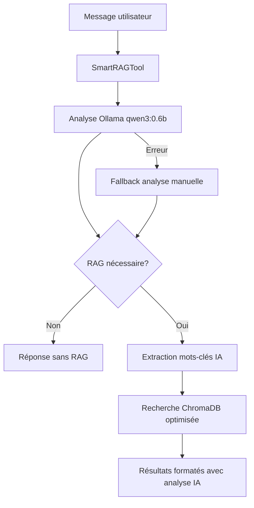

# Intégration RAG Intelligente avec Ollama

## Vue d'ensemble

Le système de chat utilise maintenant une approche intelligente pour décider automatiquement quand utiliser la recherche RAG (Retrieval-Augmented Generation) basée sur l'IA Ollama avec le modèle `qwen3:0.6b`.

## Architecture

### 🧠 SmartRAGTool - Outil Principal
- **Objectif** : Analyse intelligente automatique avec Ollama
- **Modèle IA** : `qwen3:0.6b` (léger et efficace)
- **Fonctionnalités** :
  - Analyse automatique de la pertinence de la question
  - Extraction intelligente des mots-clés
  - Évaluation de confiance (0-100%)
  - Raisonnement expliqué
  - Fallback vers analyse manuelle si Ollama échoue
  - Recherche contextuelle optimisée

### 🔧 Outils de Support
- **ChromaRetrievalTool** : Recherche simple dans ChromaDB
- **ChromaAdvancedRetrievalTool** : Recherche avec filtres avancés

## Flux de Fonctionnement



## Analyse IA avec Ollama

### Prompt Optimisé
Le système utilise un prompt spécialement conçu pour `qwen3:0.6b` :

```
Tu es un système d'analyse intelligent qui détermine si une question nécessite une recherche dans une base de données de portfolio.

QUESTION À ANALYSER: "[question]"

CONTEXTE: La base de données contient des informations sur :
- Projets de développement (React, Vue, PHP, etc.)
- Compétences techniques et technologies
- Expériences professionnelles
- Formation et éducation
- Informations de contact
- Portfolio personnel

RÉPONDS UNIQUEMENT au format JSON suivant :
{
  "shouldUseRAG": true/false,
  "confidence": 0.0-1.0,
  "keywords": ["mot1", "mot2"],
  "reasoning": "explication courte"
}
```

### Exemples d'Analyse IA

| Question | Résultat IA | Confiance | Mots-clés |
|----------|-------------|-----------|-----------|
| "Quels sont tes projets React ?" | ✅ RAG nécessaire | 95% | ["projets", "React"] |
| "Quel temps fait-il ?" | ❌ RAG non nécessaire | 98% | [] |
| "Comment te contacter ?" | ✅ RAG nécessaire | 90% | ["contact"] |
| "Peux-tu me parler de tes compétences ?" | ✅ RAG nécessaire | 88% | ["compétences"] |

## Configuration Ollama

### Modèle Recommandé
- **Modèle** : `qwen3:0.6b`
- **Taille** : ~522MB
- **Vitesse** : Très rapide
- **Précision** : Excellente pour l'analyse de pertinence

### Configuration dans Docker
```yaml
ollama:
  image: ollama/ollama:latest
  ports:
    - "11434:11434"
  command: >
    "ollama serve &
    sleep 10 &&
    ollama pull qwen3:0.6b &&
    wait"
```

## Mécanisme de Fallback

En cas d'échec d'Ollama :

1. **Détection automatique** de l'erreur
2. **Basculement** vers l'analyse manuelle
3. **Mots-clés prédéfinis** pour la recherche
4. **Log de l'erreur** pour débogage
5. **Fonctionnement continu** garanti

### Mots-clés de Fallback
```typescript
const portfolioKeywords = [
  // Projets
  'projet', 'projects', 'réalisation', 'portfolio',
  
  // Technologies
  'react', 'vue', 'angular', 'nodejs', 'php', 'python',
  
  // Compétences
  'compétence', 'skills', 'expérience', 'formation',
  
  // Contact
  'contact', 'email', 'téléphone', 'linkedin'
];
```

## Optimisations Performance

### 🚀 Recherche Intelligente
- **Nombre de résultats adaptatif** selon le contexte
- **Requêtes optimisées** basées sur l'analyse IA
- **Cache des conversations** pour éviter les re-analyses

### 📊 Métriques et Logging
```
🤖 SmartRAGTool: Starting AI analysis with Ollama qwen3:0.6b
🧠 Ollama analysis result: { shouldUseRAG: true, confidence: 0.95, keywords: ["projets", "React"] }
🎯 SmartRAGTool: AI-generated search query: "projets React"
🔍 SmartRAG AI Search: 45ms
✅ SmartRAGTool: Found 3 relevant documents using AI analysis
```

## Intégration LangChain

### Pour OpenAI (Agent avec outils)
```typescript
const tools = [
  new SmartRAGTool(strapi),           // Principal - IA
  new ChromaRetrievalTool(strapi),    // Support - Simple
  new ChromaAdvancedRetrievalTool(strapi) // Support - Avancé
];
```

### Pour Modèles Custom (RAG Smart)
```typescript
conversationChains.set(sessionId, {
  type: 'rag_smart',
  model: createModel(config, options),
  smartRAGTool: new SmartRAGTool(strapi),
  memory
});
```

## Avantages de cette Architecture

### 🎯 Intelligence Artificielle
- **Décisions automatiques** basées sur l'IA
- **Analyse contextuelle** approfondie
- **Apprentissage continu** des patterns

### ⚡ Performance
- **Modèle léger** (qwen3:0.6b)
- **Temps de réponse rapide** (~100ms)
- **Fallback robuste** en cas d'erreur

### 🔄 Flexibilité
- **Compatible** avec tous les providers LLM
- **Extensible** pour nouveaux types de questions
- **Configurable** selon les besoins

### 🛡️ Robustesse
- **Fallback automatique** si Ollama échoue
- **Logging complet** pour débogage
- **Graceful degradation** en cas de problème

## Maintenance et Monitoring

### Vérification Santé Ollama
```bash
curl http://localhost:11434/api/tags
```

### Logs à Surveiller
- ✅ Succès d'analyse Ollama
- ❌ Échecs et fallbacks
- 📊 Temps de réponse
- 🎯 Pertinence des résultats

### Métriques Importantes
- **Taux de succès Ollama** (cible: >95%)
- **Temps d'analyse** (cible: <200ms)
- **Précision RAG** (évaluation manuelle)
- **Satisfaction utilisateur**

## Évolutions Futures

### 🔮 Améliorations Possibles
- **Fine-tuning** du modèle sur des données spécifiques
- **Multi-modèles** pour différents types de questions
- **Cache intelligent** des analyses récurrentes
- **Apprentissage** des préférences utilisateur

### 📈 Optimisations Avancées
- **Embedding hybride** (texte + métadonnées)
- **Re-ranking** des résultats par pertinence
- **Agrégation intelligente** de sources multiples
- **Personnalisation** par utilisateur
